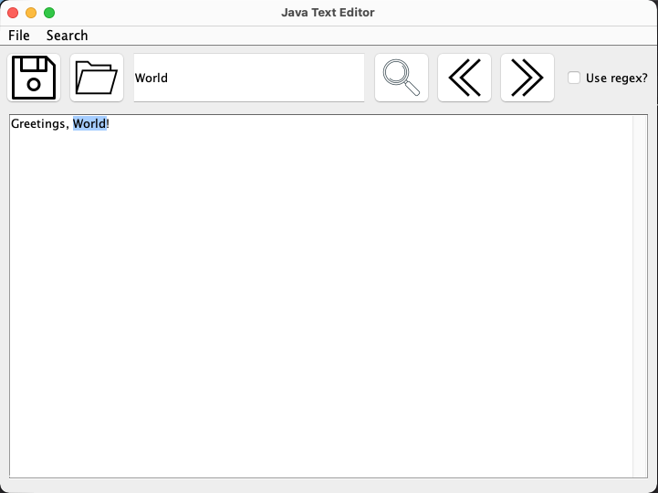

# Java text editor
A small and convenient editor based on Java with allows basic text manipulation and (regex) searching.
I built this project in order to learn more about Javas Swing Library.

## Technologies
- Java
- Swing

## How to use
Just clone the repository and start the `ApplicationRunner` class or download the compiled .jar file.

## Features
- Search for normal and regex strings
- Access essential menus and options with convenient keyboard shortcuts

## Roadmap
- Toggle dark-mode
- Add an optional file-browser on the side
- Add an optional terminal window on the bottom
- Export the project as binary for all major operating systems (mac, win, linux)
### Maybe?
- Add a plugin api
- Allow custom themes
